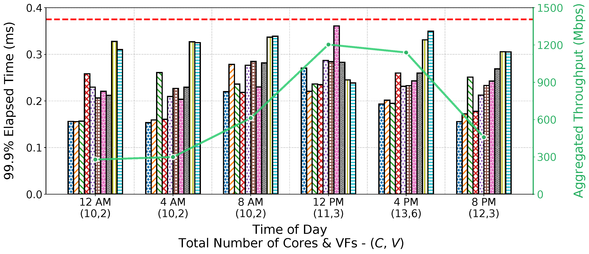
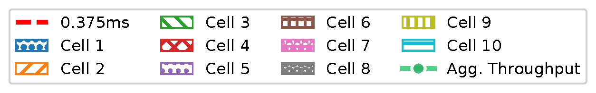

# Dynamic-Traffic Experiment Configuration

This repository documents the **exact per-cell PHY configurations** used to generate **Fig. 9** in our paper.
The goal is to ensure **full reproducibility** of the dynamic-traffic evaluation without consuming additional paper space.

  <!-- Main figure (bottom layer) -->
  

  <!-- Legend (top layer), 50% size, top-center -->
  

---

## Time-slot definition and aggregate throughput
To emulate realistic diurnal traffic patterns, we divide a 24-hour period into six representative time slots following prior cellular traffic studies [here](https://ieeexplore.ieee.org/document/7762185). 
The following table summarizes the mapping between slot IDs, wall-clock time, and the measured aggregated uplink throughput across all ten cells in each slot.

### Aggregated uplink throughput across ten cells for six representative time slots

| Time Slot ID | Time of Day | Aggregated Throughput (Mbps) |
|-------------|------------|------------------------------|
| A | 12:00 AM | 278.55 |
| B | 4:00 AM  | 299.08 |
| C | 8:00 AM  | 612.75 |
| D | 12:00 PM | 1204.03 |
| E | 4:00 PM  | 1139.88 |
| F | 8:00 PM  | 458.04 |

---

## Per-cell configuration within each time slot.
Each time slot consists of ten concurrently active cells with heterogeneous PHY-layer configurations, while traffic intensity and resulting throughput vary over time.
The following tables list the detailed per-cell configuration from Slot-A to Slot-F, including MIMO size 𝑀, channel bandwidth 𝐵, MCS, PRB utilization $ρ_{f}$, and traffic load $ρ_{f}$.

### Per-cell PHY-layer configuration for dynamic traffic experiments

#### Slot A
| Cell ID | Configuration | MCS | $ρ_{f}$ (%) | $ρ_{t}$ (%) | $θ_{i}$ |
|-------|---------------|-----|---------|---------|-----|
| A-1 | 1×1 SISO 100 MHz | 10 | 9.09 | 18.75 | $θ_{A1}$ (1,0\|1,0) |
| A-2 | 1×1 SISO 100 MHz | 11 | 12.12 | 18.75 | $θ_{A2}$ (1,0\|1,0) |
| A-3 | 1×1 SISO 100 MHz | 12 | 12.12 | 18.75 | $θ_{A3}$ (1,0\|1,0) |
| A-4 | 1×1 SISO 100 MHz | 13 | 90.90 | 93.75 | $θ_{A4}$ (1,1\|1,1) |
| A-5 | 2×2 MIMO 200 MHz | 11 | 12.12 | 68.75 | $θ_{A5}$ (1,1\|1,1) |
| A-6 | 2×2 MIMO 200 MHz | 12 | 9.09 | 18.75 | $θ_{A6}$ (1,0\|1,0) |
| A-7 | 2×2 MIMO 200 MHz | 13 | 12.12 | 18.75 | $θ_{A7}$ (1,0\|1,0) |
| A-8 | 2×2 MIMO 200 MHz | 14 | 9.09 | 18.75 | $θ_{A8}$ (1,0\|1,0) |
| A-9 | 4×4 MIMO 100 MHz | 10 | 12.12 | 18.75 | $θ_{A9}$ (1,0\|1,0) |
| A-10 | 4×4 MIMO 100 MHz | 11 | 9.09 | 18.75 | $θ_{A10}$ (1,0\|1,0) |

---

#### Slot B
| Cell ID | Configuration | MCS | $ρ_{f}$ (%) | $ρ_{t}$ (%) | $θ_{i}$ |
|-------|---------------|-----|---------|---------|-----|
| B-1 | 1×1 SISO 100 MHz | 13 | 12.12 | 18.75 | $θ_{B1}$ (1,0\|1,0) |
| B-2 | 1×1 SISO 100 MHz | 12 | 15.15 | 18.75 | $θ_{B2}$ (1,0\|1,0) |
| B-3 | 1×1 SISO 100 MHz | 11 | 90.90 | 93.75 | $θ_{B3}$ (1,1\|1,1) |
| B-4 | 1×1 SISO 100 MHz | 10 | 12.12 | 18.75 | $θ_{B4}$ (1,0\|1,0) |
| B-5 | 2×2 MIMO 200 MHz | 14 | 12.12 | 18.75 | $θ_{B5}$ (1,0\|1,0) |
| B-6 | 2×2 MIMO 200 MHz | 13 | 15.15 | 68.75 | $θ_{B6}$ (1,1\|1,1) |
| B-7 | 2×2 MIMO 200 MHz | 12 | 9.09 | 18.75 | $θ_{B7}$ (1,0\|1,0) |
| B-8 | 2×2 MIMO 200 MHz | 11 | 12.12 | 18.75 | $θ_{B8}$ (1,0\|1,0) |
| B-9 | 4×4 MIMO 100 MHz | 11 | 12.12 | 18.75 | $θ_{B9}$ (1,0\|1,0) |
| B-10 | 4×4 MIMO 100 MHz | 12 | 15.15 | 18.75 | $θ_{B10}$ (1,0\|1,0) |

---

#### Slot C
| Cell ID | Configuration | MCS | $ρ_{f}$ (%) | $ρ_{t}$ (%) | $θ_{i}$ |
|-------|---------------|-----|---------|---------|-----|
| C-1 | 1×1 SISO 100 MHz | 12 | 24.24 | 31.25 | $θ_{C1}$ (1,0\|1,0) |
| C-2 | 1×1 SISO 100 MHz | 13 | 90.90 | 93.75 | $θ_{C2}$ (1,1\|1,1) |
| C-3 | 1×1 SISO 100 MHz | 14 | 24.24 | 31.25 | $θ_{C3}$ (1,0\|1,0) |
| C-4 | 1×1 SISO 100 MHz | 15 | 21.21 | 31.25 | $θ_{C4}$ (1,0\|1,0) |
| C-5 | 2×2 MIMO 200 MHz | 13 | 21.21 | 31.25 | $θ_{C5}$ (1,0\|1,0) |
| C-6 | 2×2 MIMO 200 MHz | 14 | 24.24 | 31.25 | $θ_{C6}$ (1,0\|1,0) |
| C-7 | 2×2 MIMO 200 MHz | 15 | 21.21 | 68.75 | $θ_{C7}$ (1,1\|1,1) |
| C-8 | 2×2 MIMO 200 MHz | 16 | 24.24 | 31.25 | $θ_{C8}$ (1,0\|1,0) |
| C-9 | 4×4 MIMO 100 MHz | 12 | 21.21 | 18.75 | $θ_{C9}$ (1,0\|1,0) |
| C-10 | 4×4 MIMO 100 MHz | 13 | 24.24 | 18.75 | $θ_{C10}$ (1,0\|1,0) |

---

#### Slot D
| Cell ID | Configuration | MCS | $ρ_{f}$ (%) | $ρ_{t}$ (%) | $θ_{i}$ |
|-------|---------------|-----|---------|---------|-----|
| D-1 | 1×1 SISO 100 MHz | 16 | 90.90 | 93.75 | $θ_{D1}$ (1,1\|1,1) |
| D-2 | 1×1 SISO 100 MHz | 16 | 24.24 | 31.25 | $θ_{D2}$ (1,0\|1,0) |
| D-3 | 1×1 SISO 100 MHz | 15 | 48.48 | 43.75 | $θ_{D3}$ (1,0\|1,0) |
| D-4 | 1×1 SISO 100 MHz | 15 | 48.48 | 43.75 | $θ_{D4}$ (1,0\|1,0) |
| D-5 | 2×2 MIMO 200 MHz | 16 | 24.24 | 31.25 | $θ_{D5}$ (1,0\|1,0) |
| D-6 | 2×2 MIMO 200 MHz | 16 | 24.24 | 31.25 | $θ_{D6}$ (1,0\|1,0) |
| D-7 | 2×2 MIMO 200 MHz | 15 | 48.48 | 43.75 | $θ_{D7}$ (1,1\|1,1) |
| D-8 | 2×2 MIMO 200 MHz | 15 | 48.48 | 68.75 | $θ_{D8}$ (2,1\|2,1) |
| D-9 | 4×4 MIMO 100 MHz | 16 | 48.48 | 18.75 | $θ_{D9}$ (1,0\|1,0) |
| D-10 | 4×4 MIMO 100 MHz | 15 | 24.24 | 31.25 | $θ_{D10}$ (1,0\|1,0) |

---

#### Slot E
| Cell ID | Configuration | MCS | $ρ_{f}$ (%) | $ρ_{t}$ (%) | $θ_{i}$ |
|-------|---------------|-----|---------|---------|-----|
| E-1 | 1×1 SISO 100 MHz | 13 | 12.12 | 31.25 | $θ_{E1}$ (1,0\|1,0) |
| E-2 | 1×1 SISO 100 MHz | 12 | 15.15 | 31.25 | $θ_{E2}$ (1,0\|1,0) |
| E-3 | 1×1 SISO 100 MHz | 11 | 9.09 | 43.75 | $θ_{E3}$ (1,0\|1,0) |
| E-4 | 1×1 SISO 100 MHz | 10 | 90.90 | 93.75 | $θ_{E4}$ (1,1\|1,1) |
| E-5 | 2×2 MIMO 200 MHz | 15 | 12.12 | 68.75 | $θ_{E5}$ (1,1\|1,1) |
| E-6 | 2×2 MIMO 200 MHz | 14 | 15.15 | 31.25 | $θ_{E6}$ (1,0\|1,0) |
| E-7 | 2×2 MIMO 200 MHz | 13 | 9.09 | 43.75 | $θ_{E7}$ (1,0\|1,0) |
| E-8 | 2×2 MIMO 200 MHz | 12 | 12.12 | 43.75 | $θ_{E8}$ (1,0\|1,0) |
| E-9 | 4×4 MIMO 100 MHz | 24 | 12.12 | 18.75 | $θ_{E9}$ (1,0\|1,0) |
| E-10 | 4×4 MIMO 100 MHz | 20 | 72.72 | 81.25 | $θ_{E10}$ (4,4\|4,4) |

---

#### Slot F
| Cell ID | Configuration | MCS | $ρ_{f}$ (%) | $ρ_{t}$ (%) | $θ_{i}$ |
|-------|---------------|-----|---------|---------|-----|
| F-1 | 1×1 SISO 100 MHz | 10 | 12.12 | 18.75 | $θ_{F1}$ (1,0\|1,0) |
| F-2 | 1×1 SISO 100 MHz | 11 | 9.09 | 18.75 | $θ_{F2}$ (1,0\|1,0) |
| F-3 | 1×1 SISO 100 MHz | 12 | 90.90 | 93.75 | $θ_{F3}$ (1,1\|1,1) |
| F-4 | 1×1 SISO 100 MHz | 13 | 12.12 | 18.75 | $θ_{F4}$ (1,0\|1,0) |
| F-5 | 2×2 MIMO 200 MHz | 11 | 9.09 | 18.75 | $θ_{F5}$ (1,0\|1,0) |
| F-6 | 2×2 MIMO 200 MHz | 12 | 12.12 | 68.75 | $θ_{F6}$ (1,1\|1,1) |
| F-7 | 2×2 MIMO 200 MHz | 13 | 9.09 | 18.75 | $θ_{F7}$ (1,0\|1,0) |
| F-8 | 2×2 MIMO 200 MHz | 14 | 12.12 | 18.75 | $θ_{F8}$ (1,0\|1,0) |
| F-9 | 4×4 MIMO 100 MHz | 19 | 9.09 | 18.75 | $θ_{F9}$ (1,0\|1,0) |
| F-10 | 4×4 MIMO 100 MHz | 18 | 24.24 | 68.75 | $θ_{F10}$ (3,1\|3,1) |

---

Using a heterogeneous cell mix while varying traffic intensity across time slots allows us to isolate the impact of dynamic load on scheduling behavior. 
As shown in the evaluation (§7), Nexus adapts resource allocations across slots to maintain the 3-slot latency bound, despite a large variation in aggregated throughput from Slot-A to Slot-F.
This page provides full transparency into the per-slot and per-cell settings underlying the dynamic-traffic results.

If you have questions or want to extend this setup (e.g., FR1 or larger cell counts), feel free to open an issue.

